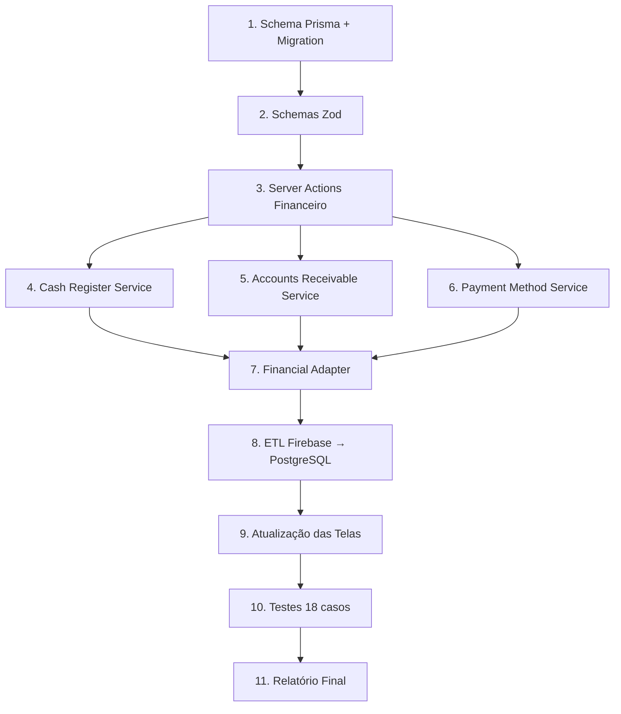

# Plano de Implementação: FASE 5 — Financeiro Base + Caixa

## Contexto e Estado Atual

O projeto está em migração gradual do Firebase/Firestore para Supabase PostgreSQL + Prisma.

- ✅ **Fase 3**: CRM (Clientes, Tags, Carteira) → PostgreSQL
- ✅ **Fase 4**: Produtos, Estoque → PostgreSQL  
- 🎯 **Fase 5 (agora)**: Financeiro Base + Caixa → PostgreSQL

O módulo financeiro **ainda usa Firestore** via `useCollection` nas coleções:
- `bank_accounts` (contas bancárias)
- `accounts_payable` (contas a pagar)
- `accounts_receivable` (contas a receber)
- `chart_of_accounts` (plano de contas)
- `caixas` (controle de caixa)

---

## Restrições Confirmadas

> [!IMPORTANT]
> - NÃO implementar PDV
> - NÃO implementar Vendas
> - NÃO remover Firebase (adapter temporário permanece)
> - NÃO alterar layout visual
> - NÃO quebrar módulos existentes (CRM, Produtos)

---

## Etapa 1 — Banco de Dados: Schema Prisma

### [MODIFY] [schema.prisma](file:///c:/Users/Felipe/Documents/GOOGLE%20DRIVES/FELYPE/CRManager/prisma/schema.prisma)

Adicionar **5 novos enums** e **8 novos modelos**:

#### Enums novos:
```prisma
enum FinancialTransactionType {
  INCOME        // Receita
  EXPENSE       // Despesa
  TRANSFER      // Transferência entre contas
  CASH_IN       // Reforço de caixa
  CASH_OUT      // Sangria de caixa
}

enum FinancialTransactionStatus {
  PENDING       // Pendente
  PAID          // Pago/Recebido
  OVERDUE       // Vencido
  CANCELLED     // Cancelado
  PARTIAL       // Parcialmente pago
}

enum CashRegisterStatus {
  OPEN          // Aberto
  CLOSED        // Fechado
  SUSPENDED     // Suspenso
}

enum PaymentMethodType {
  CASH          // Dinheiro
  DEBIT_CARD    // Cartão de Débito
  CREDIT_CARD   // Cartão de Crédito
  PIX           // PIX
  BANK_TRANSFER // Transferência Bancária
  STORE_CREDIT  // Crediário/Fiado
  CHECK         // Cheque
  OTHER         // Outros
}

enum AccountReceivableStatus {
  PENDING       // Pendente
  PARTIAL       // Parcialmente pago
  PAID          // Pago
  OVERDUE       // Vencido
  CANCELLED     // Cancelado
  RENEGOTIATED  // Renegociado
}
```

#### Novos Modelos:

**1. `BankAccount`** → tabela `bank_accounts`
- `id`, `companyId`, `name`, `bankName`, `accountNumber`, `agency`, `pixKey`
- `initialBalance: Decimal`, `currentBalance: Decimal`
- `isCashAccount: Boolean` (identifica conta-caixa física)
- `isActive`, `archivedAt`, `legacyFirebaseId`, `createdAt`, `updatedAt`
- Relações: `transactions[]`, `cashRegisters[]`

**2. `CostCenter`** → tabela `cost_centers`
- `id`, `companyId`, `name`, `code`, `description`
- `isActive`, `archivedAt`, `createdAt`, `updatedAt`
- Relações: `transactions[]`

**3. `FinancialAccount`** (Plano de Contas) → tabela `financial_accounts`
- `id`, `companyId`, `parentId?`, `code`, `name`
- `type: String` (INCOME/EXPENSE)
- `acceptsEntries: Boolean` (folha vs grupo)
- `isActive`, `archivedAt`, `legacyFirebaseId`, `createdAt`, `updatedAt`
- Relações: `parent`, `children[]`, `transactions[]`, `receivables[]`

**4. `PaymentMethod`** → tabela `payment_methods`
- `id`, `companyId`, `name`, `type: PaymentMethodType`
- `allowsInstallments: Boolean`, `autoReceive: Boolean`, `requiresAuthorization: Boolean`
- `feePercentage: Decimal`, `settlementDays: Int`
- `isActive`, `archivedAt`, `legacyFirebaseId`, `createdAt`, `updatedAt`
- Relações: `transactions[]`

**5. `CashRegister`** → tabela `cash_registers`
- `id`, `companyId`, `openedByUserId`, `closedByUserId?`, `bankAccountId`
- `openedAt`, `closedAt?`
- `openingBalance: Decimal`, `closingBalance: Decimal?`
- `expectedBalance: Decimal?`, `difference: Decimal?`
- `status: CashRegisterStatus`, `notes?`
- Relações: `openedBy`, `closedBy`, `bankAccount`, `transactions[]`, `movements[]`

**6. `FinancialTransaction`** → tabela `financial_transactions`
- `id`, `companyId`, `type: FinancialTransactionType`, `status: FinancialTransactionStatus`
- `bankAccountId?`, `cashRegisterId?`, `paymentMethodId?`, `costCenterId?`, `financialAccountId?`
- `customerId?` (para vincular ao CRM), `referenceType?`, `referenceId?`
- `description`, `amount: Decimal`, `dueDate?`, `paidAt?`
- `legacyFirebaseId?`, `createdByUserId`, `createdAt`, `updatedAt`
- Relações: todas as FKs acima

**7. `AccountsReceivable`** → tabela `accounts_receivable`
- `id`, `companyId`, `customerId?`, `financialTransactionId?`, `financialAccountId?`
- `installmentNumber: Int`, `totalInstallments: Int`
- `originalAmount: Decimal`, `paidAmount: Decimal`, `remainingAmount: Decimal`
- `dueDate`, `paidAt?`, `status: AccountReceivableStatus`, `notes?`
- `legacyFirebaseId?`, `createdAt`, `updatedAt`
- Relações: `customer?`, `transaction?`, `financialAccount?`

**8. `CashMovement`** → tabela `cash_movements`
- `id`, `companyId`, `cashRegisterId`
- `type: String` (ABERTURA/REFORCO/SANGRIA/FECHAMENTO/AJUSTE)
- `amount: Decimal`, `description?`, `createdByUserId`, `createdAt`
- Relações: `cashRegister`, `createdBy`

#### Também adicionar relações na `Company`:
```prisma
bankAccounts       BankAccount[]
costCenters        CostCenter[]
financialAccounts  FinancialAccount[]
paymentMethods     PaymentMethod[]
cashRegisters      CashRegister[]
financialTransactions FinancialTransaction[]
accountsReceivable AccountsReceivable[]
cashMovements      CashMovement[]
```

#### Migration name: `crm_financial_base`

---

## Etapa 2 — Services, Repositories e Server Actions

### [NEW] `src/lib/financial/financial-schemas.ts`
Schemas Zod de validação para todas as entidades financeiras:
- `BankAccountSchema`, `CostCenterSchema`, `FinancialAccountSchema`
- `PaymentMethodSchema`, `CashRegisterOpenSchema`, `CashRegisterCloseSchema`
- `FinancialTransactionSchema`, `AccountsReceivableSchema`, `CashMovementSchema`

### [NEW] `src/lib/financial/financial-actions.ts`
Server Actions principais com RBAC + ActivityLog:
- `createBankAccount`, `updateBankAccount`, `deleteBankAccount`, `getBankAccounts`, `getBankAccountById`
- `createCostCenter`, `updateCostCenter`, `deleteCostCenter`, `getCostCenters`
- `createFinancialAccount`, `updateFinancialAccount`, `getFinancialAccounts` (plano de contas)
- `createPaymentMethod`, `updatePaymentMethod`, `getPaymentMethods`
- `createFinancialTransaction`, `getFinancialTransactions`, `cancelFinancialTransaction`
- `createAccountsReceivable`, `payAccountReceivable`, `cancelAccountReceivable`, `getAccountsReceivable`
- Helpers: `getDashboardSummary` (saldos, receitas, despesas, vencidas)

### [NEW] `src/lib/financial/cash-register-service.ts`
Serviço dedicado ao caixa com lógica transacional:
- `openCashRegister(input)` — cria CashRegister com status OPEN + CashMovement de ABERTURA + log
- `closeCashRegister(id, input)` — calcula `expectedBalance`, `difference`, status CLOSED + CashMovement FECHAMENTO
- `addCashReinforcement(id, amount, description)` — REFORCO + atualiza BankAccount
- `addCashBleed(id, amount, description)` — SANGRIA + atualiza BankAccount
- `getCurrentOpenRegister(companyId)` — retorna o caixa aberto atual
- Regras de guarda: não permitir fechar caixa já fechado; não movimentar caixa fechado

### [NEW] `src/lib/financial/accounts-receivable-service.ts`
Serviço dedicado a contas a receber:
- `createInstallmentPlan(input)` — cria múltiplas `AccountsReceivable` em lote transacional
- `payInstallment(id, amount)` — baixa parcial ou total, atualiza `paidAmount`, `remainingAmount`, `status`
- `cancelInstallment(id)` — marca como CANCELLED
- `renegotiateInstallment(id, newDueDate, notes)` — reagendamento

### [NEW] `src/lib/financial/payment-method-service.ts`
- `getDefaultPaymentMethods(companyId)` — seed automático dos 6 métodos padrão
- `calculateFees(methodId, amount)` — calcula taxas de cartão

### [NEW] `src/lib/financial/financial-adapter.ts`
Adapter de compatibilidade temporária (como `products-adapter.ts`):
- `syncBankAccountToFirestore(id)` — mantém `bank_accounts` sincronizado no Firestore
- `syncTransactionToFirestore(id)` — idem para transações
- Não remove nada do Firebase, apenas espelha as gravações

---

## Etapa 3 — Pipeline ETL: Firebase → PostgreSQL

### [NEW] `src/lib/financial/financial-etl.ts`
Pipeline de migração das coleções financeiras do Firestore:
- Migrar `bank_accounts` → `BankAccount` (preservar `legacyFirebaseId`)
- Migrar `chart_of_accounts` → `FinancialAccount`
- Migrar `accounts_receivable` → `AccountsReceivable`
- Migrar dados de caixa → `CashRegister` + `CashMovement`
- Recalcular `currentBalance` nos `BankAccount` com base nas transações migradas
- Gerar relatório de inconsistências

### [NEW] `scripts/run-financial-etl.ts`
Script executável do ETL financeiro.

---

## Etapa 4 — Atualização das Telas

> [!IMPORTANT]
> Não alterar layout visual. Apenas trocar a fonte de dados de Firestore para Prisma/PostgreSQL.

### [MODIFY] `src/app/(dashboard)/financeiro/page.tsx`
Dashboard Financeiro: substituir `useCollection` do Firestore por Server Actions (`getDashboardSummary`, `getBankAccounts`).

### [MODIFY] `src/app/(dashboard)/financeiro/contas-bancarias/page.tsx`
Listar/criar/editar contas bancárias a partir do PostgreSQL.

### [MODIFY] `src/app/(dashboard)/financeiro/caixas/page.tsx`
Operações de caixa (abertura, reforço, sangria, fechamento) via `cash-register-service.ts`.

### [NEW] `src/app/(dashboard)/financeiro/centros-custo/page.tsx`
Gerenciamento de centros de custo (nova tela, mas seguindo o design system existente).

### [NEW] `src/app/(dashboard)/financeiro/plano-contas/page.tsx`
Gerenciamento do plano de contas (nova tela).

### [MODIFY] `src/app/(dashboard)/financeiro/contas-a-receber/page.tsx`
Contas a receber: listagem, baixa parcial/total, parcelamento.

### [NEW] `src/app/(dashboard)/financeiro/formas-pagamento/page.tsx`
Gerenciamento de formas de pagamento (nova tela).

---

## Etapa 5 — Testes Obrigatórios

### [NEW] `scripts/test-financial-flow.ts`
18 casos de teste:
1. Criar conta bancária
2. Atualizar saldo
3. Criar centro de custo
4. Criar plano de contas
5. Criar forma de pagamento
6. Abrir caixa
7. Reforço de caixa
8. Sangria de caixa
9. Fechamento de caixa
10. Criar conta a receber
11. Parcelamento (3x)
12. Baixa parcial
13. Baixa total
14. Cancelamento
15. Verificar logs de auditoria
16. Bloquear acesso sem permissão
17. Integridade transacional (rollback em falha)
18. Recalcular saldo final da conta bancária

---

## Etapa 6 — Compatibilidade e Adapter

- O `financial-adapter.ts` mantém Firebase sincronizado para as telas que ainda não foram migradas
- As coleções `accounts_payable` do Firestore não serão migradas nesta fase (contas a pagar ficam para Fase 6)
- Contas a Pagar continuam sendo lidas do Firestore para não quebrar o dashboard atual

---

## Ordem de Execução



---

## Verificação

### Testes automatizados
```bash
npx tsx scripts/test-financial-flow.ts
```

### Migration
```bash
npx prisma migrate dev --name crm_financial_base
npx prisma generate
```

### ETL
```bash
npx tsx scripts/run-financial-etl.ts
```

### Build de validação
```bash
npx tsc --noEmit
```

---

## Perguntas em Aberto

> [!IMPORTANT]
> **1. Contas a Pagar nesta fase?**
> O escopo solicitado menciona "contas a receber" explicitamente, mas não "contas a pagar". O dashboard financeiro atual usa `accounts_payable` do Firestore para os gráficos. Devo migrar contas a pagar também nesta fase ou manter do Firestore?

> [!IMPORTANT]
> **2. Formas de pagamento padrão**
> Devo pré-popular as 6 formas de pagamento padrão (Dinheiro, PIX, Débito, Crédito, Crediário, Transferência) automaticamente via seed ao criar nova empresa, ou deixar o usuário cadastrar manualmente?

> [!NOTE]
> **3. Múltiplos caixas**
> A arquitetura suporta múltiplos caixas simultâneos (campo `bankAccountId` em `CashRegister`). Porém, para a Fase 5, a lógica de "apenas um caixa aberto por vez" será suficiente para a Trupe Kids?
